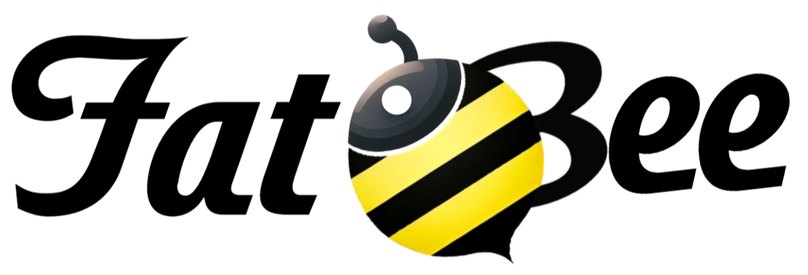

# A smooth transition to a healthier typing experience

### Mixing a familiar layout with scientifically-proven ergonomic principles

## What?

The keyboard design we use today is a relic from the 1800s, created to overcome mechanical limitations rather than for comfort: Prolonged use can lead to wrist pain, carpal tunnel syndrome, and other injuries.
While many ergonomic keyboards are available, they are often intimidating for new users.
Fat Bee's concept is to implement all the proven ergonomic principles, moderately: Scientific studies have shown that even slight key splitting and tenting combined with a lower back angle can significantly reduce discomfort and potential long-term damage.
Fat Bee offers ergonomic benefits in a package that looks and feels familiar, designed to be **approachable by users with varying typing techniques (or no typing technique at all**.

## Key features of the Fat Bee include:

- Gently split layout for a natural typing position
  
  **Why it matters:** The posture where the wrist bends outward towards the little finger (called Ulnar Deviation) is a common cause of repetitive strain injuries.

- Moderate tenting to avoid forearm pronation
  
  **Why it matters:** When the palms of your hands face down, the bones in the forearms squeeze the carpal tunnel, potentially causing nerve and tendon issues.

- Integrated palm rest and low back angle for improved wrist posture:
  
  **Why it matters:** When wrists are bent upwards (called wrist extension), it can restrict blood circulation, leading to pain, fatigue, and numbness. A palm rest shouldn't be an accessory but an integral keyboard part.

- Centralized alphanumerics for intuitive positioning
  
  **Why it matters:** Proper keyboard alignment with your body reduces unnecessary reaching and twisting, which can contribute to shoulder and upper back strain.

## Comming soon:

The prototype was hand wired, working on PCB next.
(If you're reading this 2 years from now, it means my ADHD hyperfixation died and this project never got a PCB. Don't blame me, blame Dave...)

## License

FatBee by Cassiozen is licensed under <a href="https://creativecommons.org/licenses/by-nc/4.0/?ref=chooser-v1" target="_blank" rel="license noopener noreferrer" style="display:inline-block;">CC BY-NC 4.0</a>, meaning you can use it, remix, adapt, but not sell as a product (I won't be upset if you sell a couple to your friends - for more than that, get in touch at cassiozen (at) gmail com.)

